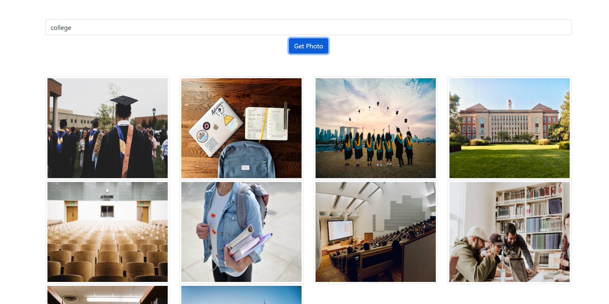
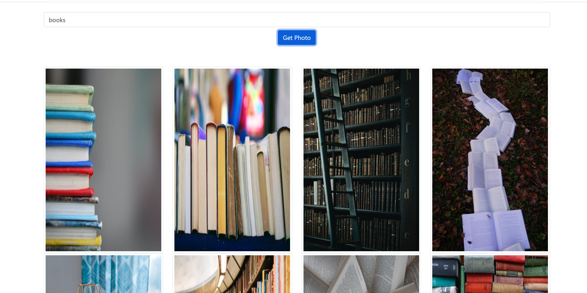
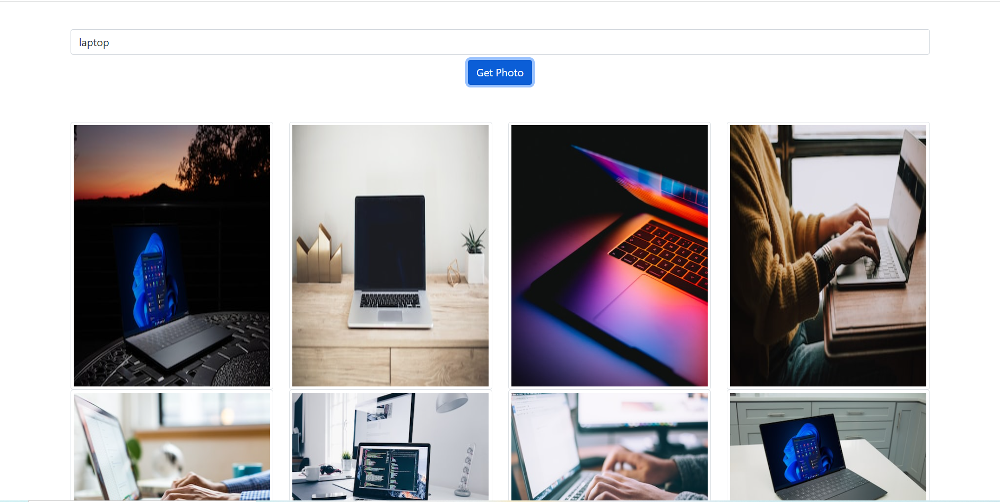

### Build an Image Search Web App using the Unsplash API and ReactJs to get access to its enormous collection of images.

# `Image Search Web App`
### This is a simple Image Search Web App made using  
- `ReactJs` 
- `Unsplash AP`
- `Bootstrap`

[Check out the website here](https://github.com/GkY273303/imagesearchapp/)

## `illustrative`

#### if Search college 
    
#### if Search books 
    
#### if Search laptop
  
